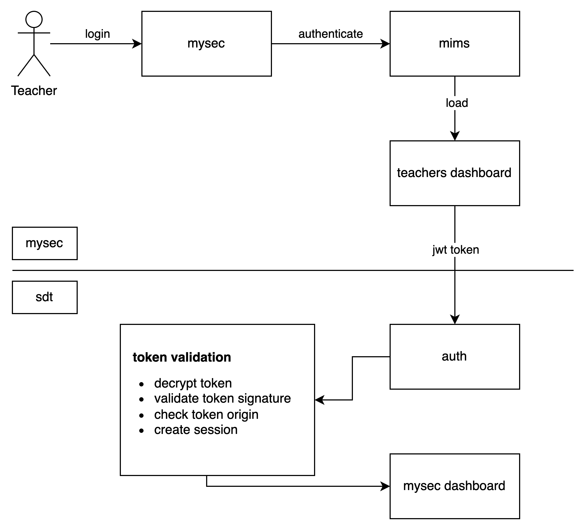

## Author(s)

- Wei Jun / @Physium
- Lai Ho / @iamlaiho
- Wilson / @wholesomewilson
- Eileen / @kmye

## Discussion & Voting Timeline

- Discussion open until 2025-06-27
- Voting starts when the author calls for it
- Voting ends on 2025-07-01 or when consensus is reached

## Summary

Since SDT's goal is to serve as a tool that helps teachers use data to better understand their students, integrating assessment data from MySEC into SDT makes sense. MySEC is where students submit assessments and where teachers manage them. SDT is used for viewing analytics and performance trends.

To streamline the user experience, we propose implementing a backchannel token exchange mechanism that allows users already authenticated in MySEC to access SDT without needing to log in again.

## Motivation

Currently, MySEC and SDT are two separate web applications deployed on different domains. Teachers frequently switch between these two platforms. Requiring them to log in twice creates friction and adds to support burden.

A seamless transition from MySEC to SDT is desirable. By securely passing a short-lived, signed authentication token (JWT) from MySEC to SDT, we can automate the login behind the scenes, improving the overall user experience.

## Detailed Design

We propose the following mechanism:

### Overview

- Upon successful login to MySEC, a **short-lived JWT** will be issued containing the teacher’s identity and relevant claims.
- When the teacher navigates to SDT, a redirect with a query param will deliver this JWT to SDT.
- SDT will validate the token using a **public key** (RS256 or ES256) and create a session for the teacher if the token is valid.

### JWT Claims

Example payload:

```json
{
  "iss": "mysec.gov.sg",
  "aud": "sdt.gov.sg",
  "sub": "teacher-uuid-123",
  "email": "teacher@example.edu.sg",
  "role": "teacher",
  "iat": 1719305000,
  "exp": 1719305300
}
```

### **Token Security**

- JWTs will be signed using RS256.
- Tokens will expire within 3–5 minutes of issuance.
- SDT will reject tokens with:
  - Invalid signature
  - Expired exp
  - Unexpected aud or iss fields

### **Token Transfer**

Authentication tokens will be transferred via a redirect using query parameters. This mechanism allows MySEC to hand off users to SDT without introducing additional complexity or workflow.

While redirect-based token transmission introduces several known security considerations—such as:

- Exposure of tokens in browser history and server logs
- Potential leakage via the Referer header when SDT loads third-party resources
- Possibility of replay attacks if tokens are intercepted and reused

These risks are mitigated through the following safeguards:

- The JWT contains only non-sensitive user attributes (e.g., email address)
- Tokens are short-lived (e.g., 3–5 minutes) and single-use
- SDT validates the iss, aud, and token signature before establishing a session
- Tokens are invalidated upon successful redemption

Given the trust boundary between MySEC and SDT, and the practical constraints of a redirect-based login handoff, this approach strikes a balance between security and implementation simplicity for the initial rollout.

### High Level Diagram



## Alternatives Considered

### **Central Identity Provider (OIDC)**

We considered integrating both apps with a centralized OIDC provider (e.g., Auth0, Azure AD, or a self-hosted IdP like Keycloak). While this is standards-compliant and scalable, it introduces additional backlog to both apps.

Given that both MySEC and SDT are internally developed and trusted, and our need is limited to these two systems, a JWT-based backchannel approach is more lightweight and pragmatic for a pilot. We eventually SHOULD move towards a central OIDC or MIMS v2.

## Drawbacks

- Requires MySEC and SDT to coordinate token signing and verification logic.
- Initial implementation will require both apps to handle token issuance and validation securely.
- Backchannel token misuse could lead to session fixation or CSRF attacks if not implemented correctly (e.g., if login endpoints accept GET requests or set cookies without origin validation).
